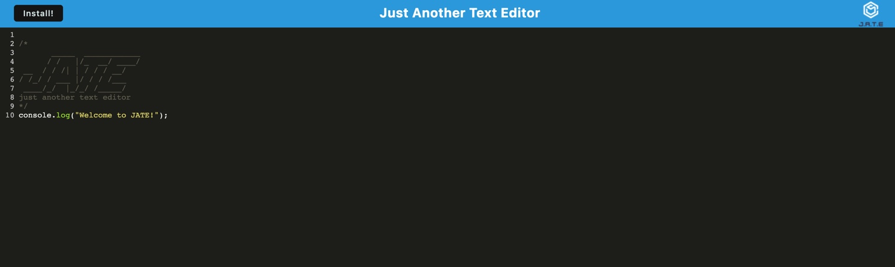
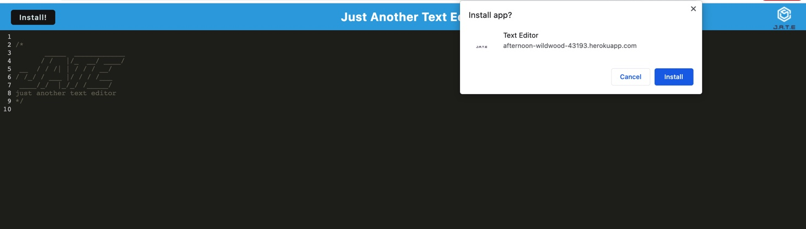
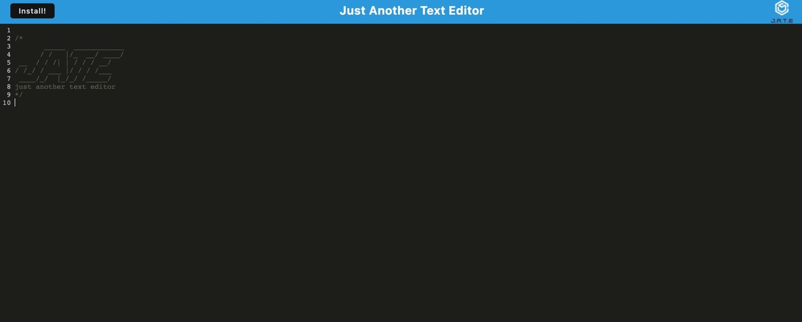

# PWA-Text-Editor

## Description

The goal of this project was to create a text editor that meets the requirements of a Progressive Web Application(PWA). It is a single page application that runs in the browser. The app features different data persistence techniques in case one of the options is not supported by the browser. Another cool feature of this app is that it functions offline.

## License:  

## Table of Contents
1. [Description](#description)
2. [Installation](#installation)
3. [Usage](#usage)
4. [Credits](#credits)
5. [Contributing](#contributing)
6. [License](#license)
7. [Questions](#questions)

## Installation

In order for this application to work you will need the node environment installed on your computer. Adequate instructions for downloading the node environment can be found at nodejs.org. To install all dependencies for this program, start by opening the package.json file in an integrated terminal and run "npm install".

## Usage
1. Make sure all dependencies are installed by running npm install.
2. Then run "npm run start", which will run the build and start the server.

Deployed Site: https://afternoon-wildwood-43193.herokuapp.com/

### Images
  

  

  

## Credits

- MDN Web Docs
- npmjs.com
- webpack.js.org
- VSCode
- StackOverflow

## Contributing

  
For contributing guidelines see link : https://www.contributor-covenant.org/

## License 
This Project is licensed under the MIT license.

* https://opensource.org/licenses/MIT

## Questions

Follow link for github: [Github Profile] (https://github.com/gallaghj13)  
For any additional questions you can reach me at: gallagherj0913@gmail.com